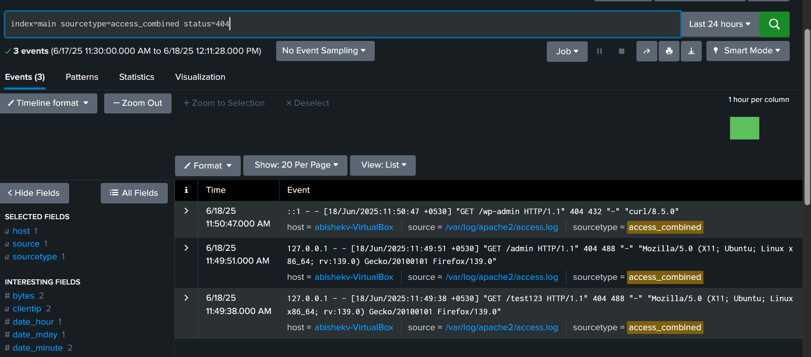
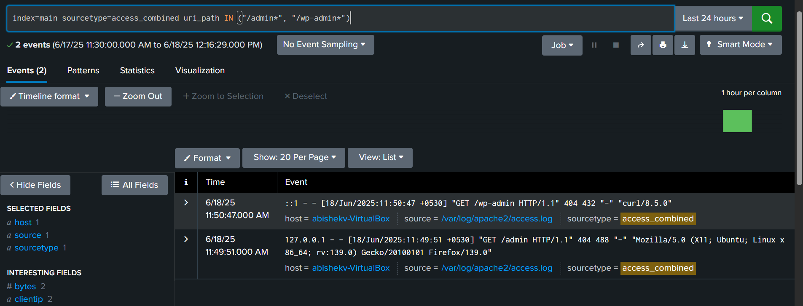

#  Splunk SOC Labs: Day 1 - Log Ingestion and Threat Detection


This repository documents my **two-week journey to master Splunk** for Security Operations Center (SOC) tasks.

On **Day 1**, I configured the **Splunk Universal Forwarder** on an Ubuntu Desktop VM to send **Apache web server logs** to **Splunk Enterprise** on my Windows laptop. I performed searches to detect suspicious activity (e.g., 404 errors, admin path requests) and visualized results — simulating real-world SOC threat detection.

---

## 🔧 Day 1: Forwarding Apache Logs & Detecting Suspicious Activity

###  Objective

Set up log forwarding from Apache on an Ubuntu VM to Splunk Enterprise, analyze logs for potential threats and create visualizations to support SOC analysis.

---

###  Lab Environment

| Component        | Details                                               |
|------------------|--------------------------------------------------------|
| **Host**         | Windows laptop running Splunk Enterprise (`http://localhost:8000`) |
| **VM**           | Ubuntu Desktop (in VirtualBox) with Apache and Splunk Universal Forwarder |
| **Tools Used**   | Splunk Enterprise, Splunk Universal Forwarder, Apache2, Firefox, curl |

---

###  Setup Instructions

1. **Start Splunk Enterprise (Windows)**:
    ```bash
    "C:\Program Files\Splunk\bin\splunk" start
    ```
    - Enable data receiving on **port 9997** via:
      ```
      Settings > Forwarding and Receiving > Receive Data
      ```

2. **Configure Splunk Universal Forwarder (Ubuntu VM)**:
    ```bash
    /opt/splunkforwarder/bin/splunk start
    /opt/splunkforwarder/bin/splunk add forward-server <splunk ip>:9997 -auth admin:<password>
    ```

3. **Install and Start Apache2 (Ubuntu VM)**:
    ```bash
    sudo apt install apache2 -y
    sudo systemctl start apache2
    ```
  

4. **Forward Apache Logs to Splunk**:
    ```bash
    /opt/splunkforwarder/bin/splunk add monitor /var/log/apache2/access.log -sourcetype access_combined -index main
    /opt/splunkforwarder/bin/splunk restart
    ```

---

###  Lab Activities

#### 🔹 Generate Logs:
- Visit invalid paths (e.g., `/test123`, `/wp-admin`) using Firefox.
- Use `curl` for non-existent pages:

#### 🔹 Perform Splunk Searches:

- **All events**:
    ```spl
    index=main sourcetype=access_combined
    ```

- **404 Errors**:
    ```spl
    index=main sourcetype=access_combined status=404
    ```

- **Admin Path Access**:
    ```spl
    index=main sourcetype=access_combined uri_path IN ("/admin*", "/wp-admin*")
    ```


- **404 Errors Search**  
  

- **Admin Path Requests Search**  
  


---


